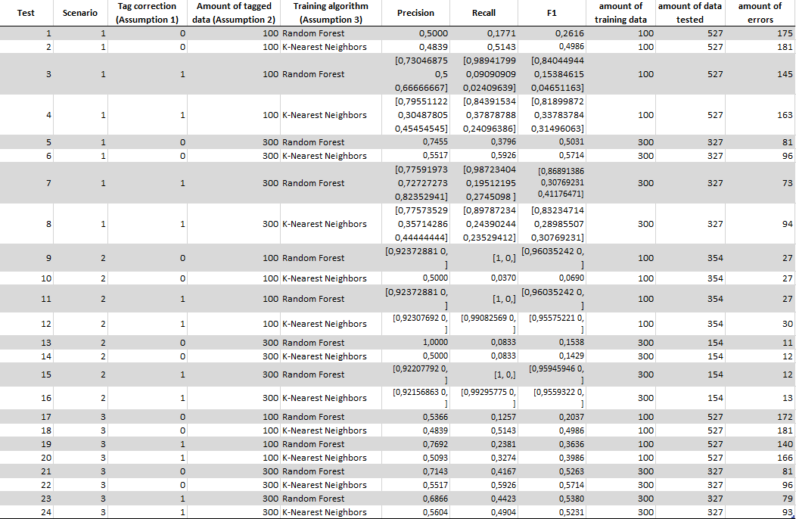

# social-networks-analysis
Taller 3  -  Jorge Florez
From the sentiment analysis tutorial on Twitter of the repository seen in class, through tests, strategies are proposed to improve the precision, recall and F1 metrics.

## Table of Contents
 - [Results](#results).
 - [Usage](#usage).
 - [Author](#author).

## Results
 - Evidence screenshot of results table.
 
 
 
 - I believe that the main strategy is to have a large training dataset labeled with as much detail as possible.
 - The detailed knowledge of the operation of the algorithms, as well as the nature and context of the data, allow greater precision of which of the existing classifying algorithms is viable for the analysis of the information.
 - The main difficulty in this workshop was to increase the prediction in the 'positive' and 'neutral' classes due to the small amount of data of this type that the dataset had.

## Usage
 - The video evidence of the correct functioning of each of the requested requirements can be found in the following [link](https://youtu.be/tYa3Q127Rck).

## Author
 - Jorge Octavio Florez Caro.
